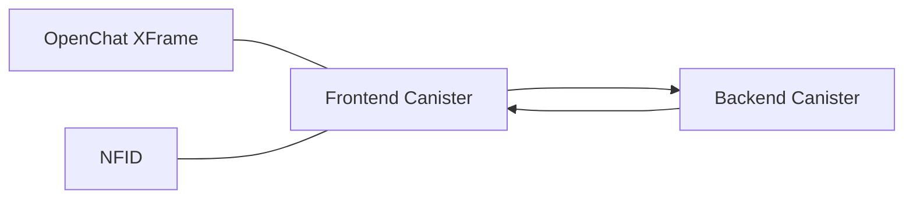

# Konectª Pre-Register WebApp

WebApp for **Konectª** Pre-register Campaign. It includes a simple Pre-Register Button using NFID, that generates a random number of Seconds. These Seconds will be used as a part of a bigger campaign.
> Want to try it? You should give it a trial yourself [here](https://mbdqw-eiaaa-aaaag-qkdsq-cai.icp0.io/ "https://mbdqw-eiaaa-aaaag-qkdsq-cai.icp0.io/")

# Technology Used

Devekioed using Motoko, React and Vite, integrating NFID and Openchat.

