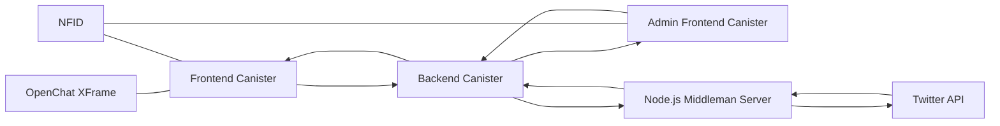

# Konectª Pre-Register WebApp

WebApp for  **Konectª**  Pre-register Campaign. It includes a Pre-Register Button using NFID, that generates a random number of Seconds. These Seconds are then used as a part of a bigger campaign, and can be increased by doing more missions on the page.

> Want to try it? You should give it a trial yourself  [here](https://pre.konecta.one/ "https://pre.konecta.one/")

# Technology Used

Developed using Motoko, React and Vite, integrating NFID and Openchat, and including a Node.js Middleman to reach Twitter API.

