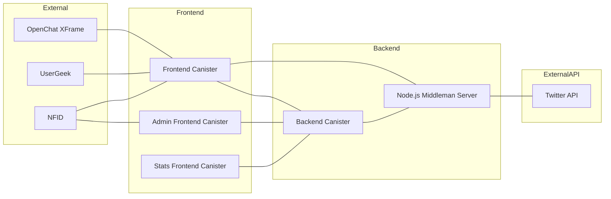

# Konectª Pre-Register WebApp - Project Overview

This preregister WebApp for **Konectª** is developed using **Motoko**, **React**, and **Vite**, allows users to complete missions to earn "seconds". It integrates **NFID's new IdentityKit** for authentication and includes an **OpenChat iframe**. Additionally, the app incorporates **userGeek** to track site metrics and uses a **Node.js middleman** to access the Twitter API, facilitating an IPv4 to IPv6 outcall.

> Want to try it? You should give it a trial yourself [here](https://pre.konecta.one/  "https://pre.konecta.one/")
  

