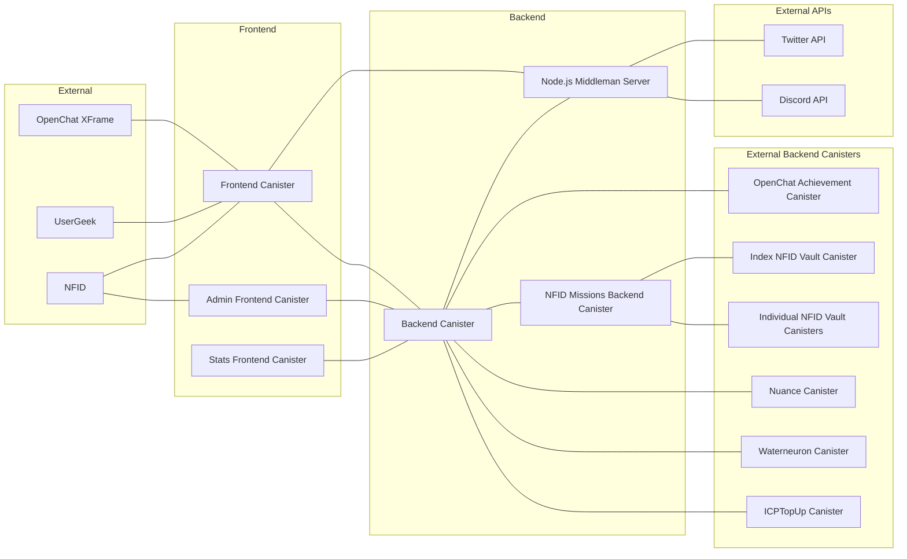

# Konectª Pre-Register WebApp - Project Overview

Welcome to the **Konectª Pre-Register WebApp** repository! This application allows users to complete missions to earn "seconds", integrating seamlessly with various projects within the Internet Computer ecosystem.

## Table of Contents

- [Overview](#overview)
- [Features](#features)
- [Technologies Used](#technologies-used)
- [Integrations](#integrations)
- [Live Demo](#live-demo)
- [Architecture](#architecture)
- [License](#license)
- [Contact](#contact)

## Overview

The Konectª Pre-Register WebApp is developed using **Motoko**, **React**, and **Vite**. It enables users to:

- Complete missions to earn "seconds".
- Authenticate securely using **NFID's IdentityKit**.
- Communicate via an embedded **OpenChat iFrame**.
- Access Twitter and Discord APIs through a **Node.js middleman server** to facilitate mission-related activities.

**Note**: Site metrics are tracked by the developers using **UserGeek** to monitor application performance and usage.

## Features

- **Mission Completion**: Engage with integrated projects to earn rewards by completing specific tasks.
- **Secure Authentication**: Utilize NFID's IdentityKit for user authentication.
- **Embedded OpenChat**: Connect directly with OpenChat without leaving the app.
- **Analytics Tracking**: Developer tracks site usage with UserGeek.
- **Social Media Integration**: Facilitate missions such as following projects or joining Discord servers using Twitter and Discord APIs.

## Technologies Used

- **Motoko**: Backend development language for Internet Computer.
- **React**: Frontend library for building user interfaces.
- **Vite**: Fast frontend build tool.
- **NFID's IdentityKit**: Authentication framework.
- **OpenChat**: Decentralized chat application.
- **UserGeek**: Analytics platform used by the developer to track site metrics.
- **Node.js**: Server environment for the middleman server.
- **Twitter and Discord APIs**: For creating and managing mission-related tasks.

## Integrations

Konectª currently integrates with the following projects:

- **NFID Vaults**
- **OpenChat**
- **Nuance**
- **WaterNeuron**
- **ICPTopUp**

Additionally, missions leverage:
- **Twitter API**: To create missions like following specific Twitter accounts.
- **Discord API**: To create missions such as joining particular Discord servers.

## Live Demo

Experience the app firsthand: [Konectª Pre-Register WebApp](https://pre.konecta.one/)

## Architecture

The application's architecture is illustrated below:
  

## License

This project is licensed under the **MIT License** with the **Commons Clause**. See the [LICENSE](LICENSE) file for details.

## Contact

For questions or support, please contact:

- **Twitter**: [@KonectA_Dao](https://twitter.com/KonectA_Dao)